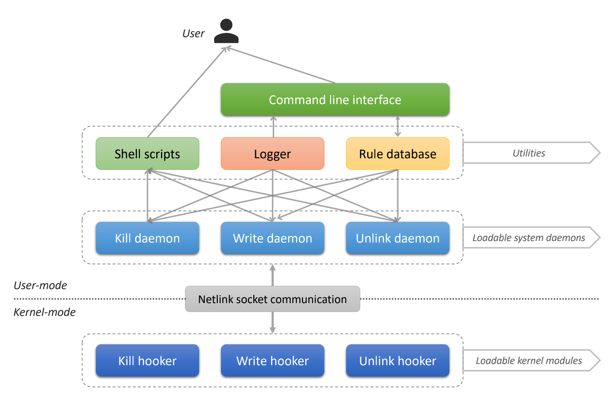
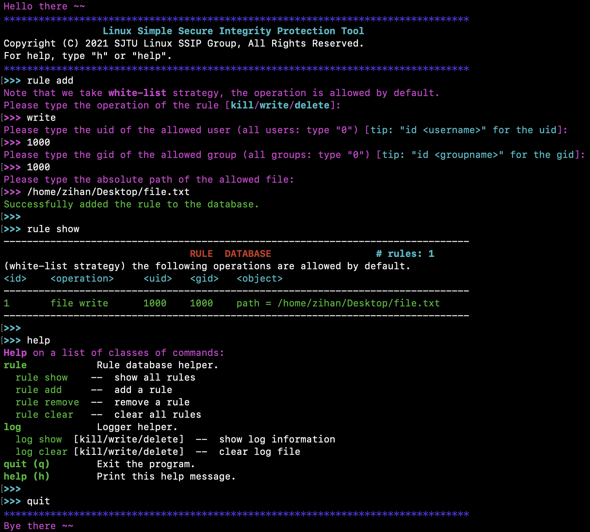

## Linux-SSIP: Linux Simple and Secure Integrity Protection tool
Our Team -- Zihan Liu, Jinhao Li, Shanqing Qi, and Zichao Xia.

Project For SJTU-IS415: System Software Course Design

### Architecture



### Usage

* Prerequisites

  ```shell
  apt install gcc g++ cmake
  ```

* Installation

  ```shell
  git clone https://github.com/sjtu-linux-ssip/linux-ssip.git
  cd linux-ssip
  # `make help` for detailed usage
  make        # install
  make test   # (optional) run user-mode tests 
  ```

* Launch

  ```shell
  make start  # start service
  make ui     # launch command line interface
  ```

* Terminate

  ```shell
  make stop   # stop service
  make clean  # uninstall
  ```

* Notes

  * For rule database, we adopt white-list strategy. That is, the user or group can only be allowed to tamper something (e.g. kill a process, write or delete a file), rather than being refused to do something. This greatly limits the permission of the user or group, and guarantees the integrity of the system.

  * When the user is allowed to write or delete a file, he or she can only perform like this:

    ```shell
    >> vim /home/zihan/Desktop/file.txt  # vim <absolute path>
    >> rm /home/zihan/Desktop/file.txt   # rm <absolute path>
    >> vim file.txt                      # still NOT allowed, MUST provide absolute path
                                         # match the file path in the rule database
    >> rm file.txt                       # still NOT allowed
    ```

### Our awesome UI 🤩



### License

[ GPL-3.0 License](https://github.com/sjtu-linux-ssip/linux-ssip/blob/main/LICENSE)
