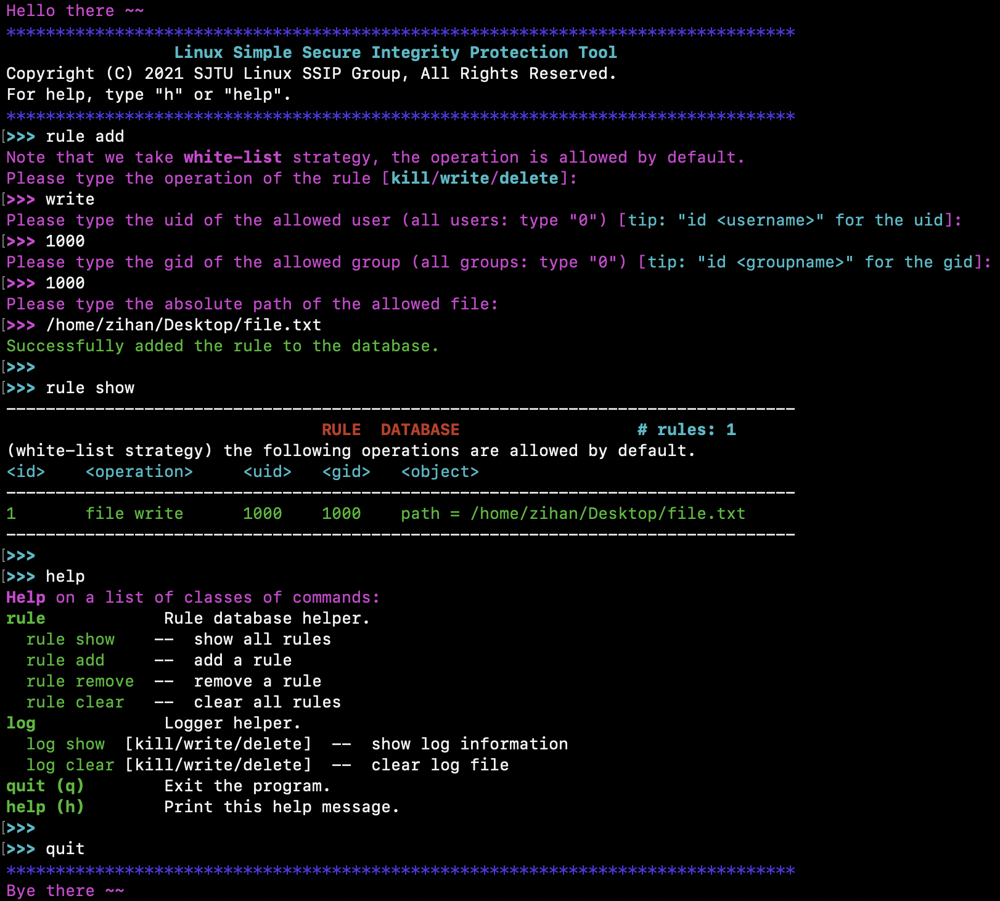

## Linux-SSIP: Linux Simple and Secure Integrity Protection tool
Our Team -- Zihan Liu, Jinhao Li, Shanqing Qi, and Zichao Xia.

Project For SJTU-IS415: System Software Course Design

### TODO

- [ ] Joint test for the whole software combining the user-mode and kernel-mode
  * Multiple netlink module BUG: https://github.com/sjtu-linux-ssip/linux-ssip/issues/3
- [ ] Integrity protection for specific important programs such as firewall
- [ ] Final presentation and project report

### Usage

* Prerequisites

  ```shell
  apt install gcc g++ cmake
  ```

* Installation

  ```shell
  git clone https://github.com/sjtu-linux-ssip/linux-ssip.git
  cd linux-ssip
  # `make help` for detailed usage
  make
  make test   # (optional) run tests for user-mode 
  ```

* Launch

  ```shell
  make start  # NOTE that kernel modules have a BUG (issue 3)
  make ui     # launch command line interface
  ```

* Terminate

  ```shell
  make stop
  make clean
  ```

### License

[ GPL-3.0 License](https://github.com/sjtu-linux-ssip/linux-ssip/blob/main/LICENSE)

### Our awesome UI 🤩



